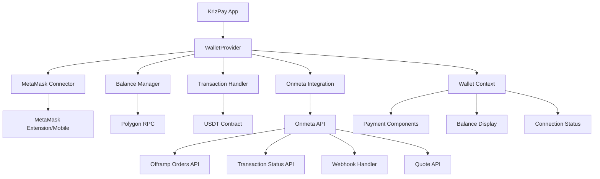
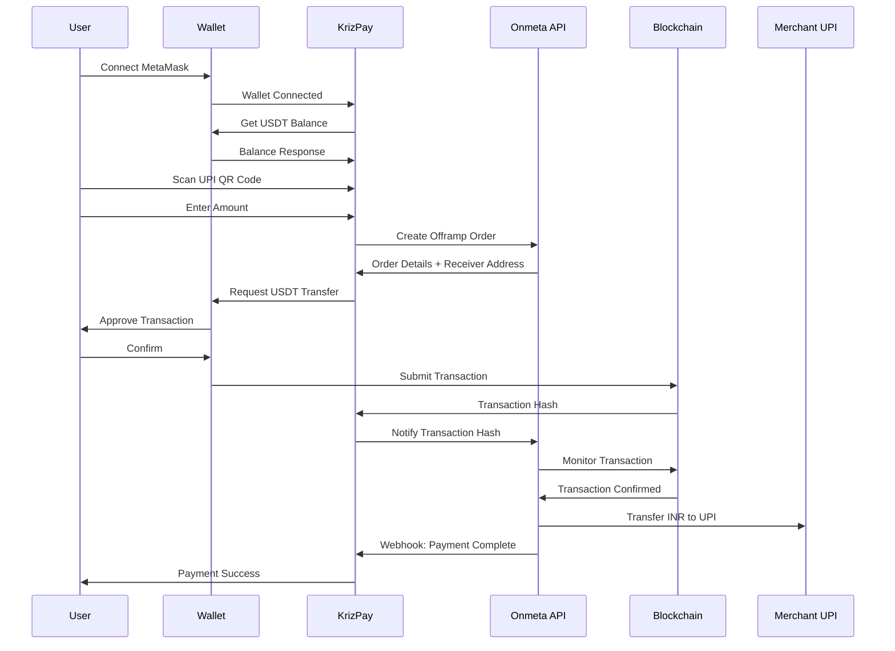
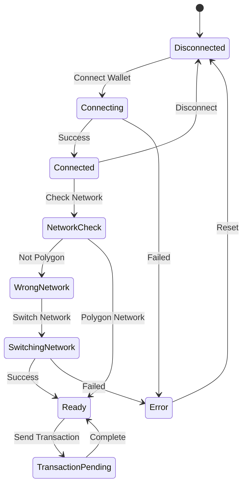

# MetaMask Integration Design Document

## Overview

The MetaMask integration will provide seamless wallet connectivity for KrizPay users, enabling secure USDT transactions on the Polygon network through Onmeta's offramp API. The design leverages Onmeta's comprehensive documentation to create a complete crypto-to-UPI payment flow, focusing on user experience, error handling, and mobile compatibility while maintaining security best practices.

### Onmeta API Integration Points

Based on Onmeta documentation, the integration will utilize:
- **Offramp Orders API**: `/v1/offramp/orders/create` for crypto-to-UPI conversions
- **Transaction Status API**: `/v1/transactions/{id}` for real-time status updates
- **Webhook System**: Real-time payment status notifications
- **Quote API**: Real-time exchange rate and gas estimation
- **Instant Payout**: Direct UPI transfers with linked bank accounts

## Architecture

### Component Architecture with Onmeta Integration



### Onmeta Payment Flow Integration



### State Management Flow



## Components and Interfaces

### 1. WalletProvider Component

**Purpose**: Main context provider for wallet state management

**Props**:
```typescript
interface WalletProviderProps {
  children: React.ReactNode;
}
```

**State**:
```typescript
interface WalletState {
  isConnected: boolean;
  address: string | null;
  balance: string;
  isLoading: boolean;
  error: string | null;
  chainId: number | null;
  isCorrectNetwork: boolean;
}
```

**Methods**:
- `connectWallet()`: Initiate MetaMask connection
- `disconnectWallet()`: Clear wallet connection
- `switchNetwork()`: Switch to Polygon network
- `refreshBalance()`: Update USDT balance
- `sendTransaction()`: Execute USDT transfer

### 2. WalletConnection Component

**Purpose**: UI component for wallet connection/disconnection

**Features**:
- Connect/Disconnect button
- Wallet address display (truncated)
- Connection status indicator
- MetaMask installation check

**Design**:
```typescript
interface WalletConnectionProps {
  className?: string;
  showBalance?: boolean;
}
```

### 3. useWallet Hook

**Purpose**: Custom hook for accessing wallet functionality

**Returns**:
```typescript
interface UseWalletReturn {
  isConnected: boolean;
  address: string | null;
  balance: string;
  isLoading: boolean;
  error: string | null;
  isCorrectNetwork: boolean;
  connectWallet: () => Promise<void>;
  disconnectWallet: () => void;
  switchNetwork: () => Promise<void>;
  sendUSDT: (to: string, amount: string) => Promise<string>;
}
```

### 4. NetworkSwitcher Component

**Purpose**: Handle network switching to Polygon

**Features**:
- Automatic network detection
- Switch network prompt
- Add network if not present
- Network status display

### 5. TransactionHandler Service

**Purpose**: Manage USDT transactions on Polygon

**Methods**:
```typescript
class TransactionHandler {
  async getUSDTBalance(address: string): Promise<string>;
  async sendUSDT(to: string, amount: string): Promise<string>;
  async estimateGas(to: string, amount: string): Promise<string>;
  async waitForTransaction(hash: string): Promise<TransactionReceipt>;
}
```

## Data Models

### Wallet Configuration with Onmeta Integration

```typescript
interface WalletConfig {
  POLYGON_CHAIN_ID: number;
  POLYGON_RPC_URL: string;
  USDT_CONTRACT_ADDRESS: string;
  USDT_DECIMALS: number;
  ONMETA_API_BASE: string;
  ONMETA_STAGING_API: string;
}

const WALLET_CONFIG: WalletConfig = {
  POLYGON_CHAIN_ID: 137,
  POLYGON_RPC_URL: 'https://polygon-rpc.com',
  USDT_CONTRACT_ADDRESS: '0xc2132D05D31c914a87C6611C10748AEb04B58e8F',
  USDT_DECIMALS: 6,
  ONMETA_API_BASE: 'https://api.onmeta.in/v1',
  ONMETA_STAGING_API: 'https://stg.api.onmeta.in/v1'
};
```

### Onmeta API Data Models

```typescript
// Based on Onmeta API documentation
interface OnmetaOfframpOrder {
  sellTokenSymbol: string;
  sellTokenAddress: string;
  chainId: number;
  fiatCurrency: string;
  fiatAmount: number;
  senderWalletAddress: string;
  refundWalletAddress: string;
  bankDetails: {
    accountNumber: string;
    ifsc: string;
  };
  metaData: {
    merchantTxId: string;
    upiId: string;
    webhook_url: string;
  };
}

interface OnmetaOrderResponse {
  success: boolean;
  data: {
    orderId: string;
    receiverWalletAddress: string;
    gasUseEstimate: string;
    quote: {
      exchangeRate: number;
      fees: number;
      totalAmount: number;
    };
    expiryTime: string;
    status: 'PENDING' | 'PROCESSING' | 'COMPLETED' | 'FAILED';
  };
  message?: string;
}

interface OnmetaWebhookPayload {
  orderId: string;
  merchantTxId: string;
  status: 'SUCCESS' | 'FAILED' | 'PENDING' | 'PROCESSING';
  upiId: string;
  fiatAmount: number;
  cryptoAmount: number;
  txHash?: string;
  timestamp: string;
  failureReason?: string;
}

interface OnmetaQuoteRequest {
  sellTokenSymbol: string;
  chainId: number;
  fiatCurrency: string;
  fiatAmount: number;
}

interface OnmetaQuoteResponse {
  success: boolean;
  data: {
    exchangeRate: number;
    cryptoAmount: number;
    fees: {
      platformFee: number;
      networkFee: number;
      totalFee: number;
    };
    estimatedGas: string;
    validUntil: string;
  };
}
```

### Transaction Data

```typescript
interface WalletTransaction {
  hash: string;
  from: string;
  to: string;
  amount: string;
  gasUsed: string;
  status: 'pending' | 'confirmed' | 'failed';
  timestamp: number;
}
```

### Error Types

```typescript
enum WalletErrorType {
  NOT_INSTALLED = 'NOT_INSTALLED',
  USER_REJECTED = 'USER_REJECTED',
  WRONG_NETWORK = 'WRONG_NETWORK',
  INSUFFICIENT_BALANCE = 'INSUFFICIENT_BALANCE',
  INSUFFICIENT_GAS = 'INSUFFICIENT_GAS',
  TRANSACTION_FAILED = 'TRANSACTION_FAILED',
  NETWORK_ERROR = 'NETWORK_ERROR'
}

interface WalletError {
  type: WalletErrorType;
  message: string;
  details?: any;
}
```

## Error Handling

### Error Categories and Responses

1. **Installation Errors**
   - Detect MetaMask presence
   - Show installation instructions
   - Provide download links

2. **Connection Errors**
   - Handle user rejection
   - Retry connection options
   - Clear error states

3. **Network Errors**
   - Automatic network switching
   - Manual network instructions
   - Network status monitoring

4. **Transaction Errors**
   - Gas estimation failures
   - Insufficient balance warnings
   - Transaction rejection handling

5. **Balance Errors**
   - RPC connection issues
   - Contract call failures
   - Retry mechanisms

### Error Recovery Strategies

```typescript
interface ErrorRecovery {
  [WalletErrorType.NOT_INSTALLED]: () => void; // Show installation guide
  [WalletErrorType.USER_REJECTED]: () => void; // Show retry option
  [WalletErrorType.WRONG_NETWORK]: () => Promise<void>; // Auto switch network
  [WalletErrorType.INSUFFICIENT_BALANCE]: () => void; // Show balance warning
  [WalletErrorType.INSUFFICIENT_GAS]: () => void; // Suggest gas adjustment
  [WalletErrorType.TRANSACTION_FAILED]: () => void; // Show retry option
  [WalletErrorType.NETWORK_ERROR]: () => void; // Show network status
}
```

## Testing Strategy

### Unit Tests

1. **WalletProvider Tests**
   - State management
   - Connection flow
   - Error handling
   - Network switching

2. **Hook Tests**
   - useWallet functionality
   - State updates
   - Error propagation

3. **Component Tests**
   - WalletConnection UI
   - NetworkSwitcher behavior
   - Error display

### Integration Tests

1. **MetaMask Integration**
   - Connection flow
   - Transaction signing
   - Network switching
   - Account changes

2. **Contract Interaction**
   - USDT balance fetching
   - Transaction execution
   - Gas estimation

3. **Error Scenarios**
   - Network failures
   - User rejections
   - Invalid transactions

### E2E Tests

1. **Complete Payment Flow**
   - Wallet connection
   - Balance check
   - Payment execution
   - Status updates

2. **Mobile Testing**
   - MetaMask mobile app
   - Deep linking
   - Transaction approval

3. **Error Recovery**
   - Network switching
   - Transaction retries
   - Connection recovery

## Security Considerations

### Best Practices

1. **Never store private keys**
2. **Validate all user inputs**
3. **Use secure RPC endpoints**
4. **Implement proper error boundaries**
5. **Sanitize transaction data**

### Security Measures

```typescript
interface SecurityConfig {
  MAX_TRANSACTION_AMOUNT: string;
  TRANSACTION_TIMEOUT: number;
  RPC_RATE_LIMIT: number;
  ADDRESS_VALIDATION: RegExp;
}
```

### Audit Points

1. **Contract interactions**
2. **RPC call validation**
3. **User input sanitization**
4. **Error message security**
5. **State management security**

## Performance Optimization

### Caching Strategy

1. **Balance caching** with 30-second TTL
2. **Network status caching**
3. **Transaction history caching**
4. **RPC response caching**

### Lazy Loading

1. **MetaMask detection on demand**
2. **Contract ABI loading**
3. **Network configuration loading**

### Optimization Techniques

1. **Debounced balance updates**
2. **Memoized component renders**
3. **Efficient state updates**
4. **Minimal re-renders**

## Mobile Considerations

### MetaMask Mobile Integration

1. **Deep linking support**
2. **WalletConnect fallback**
3. **Mobile-specific UI adjustments**
4. **Touch-friendly interactions**

### Responsive Design

1. **Mobile-first approach**
2. **Touch target optimization**
3. **Modal sizing for mobile**
4. **Gesture support**

## Implementation Phases

### Phase 1: Core Integration
- Basic MetaMask connection
- Polygon network support
- USDT balance display

### Phase 2: Transaction Handling
- USDT transfer functionality
- Transaction status tracking
- Error handling

### Phase 3: Mobile Optimization
- MetaMask mobile support
- Deep linking
- Mobile UI improvements

### Phase 4: Advanced Features
- Transaction history
- Gas optimization
- Multi-account support